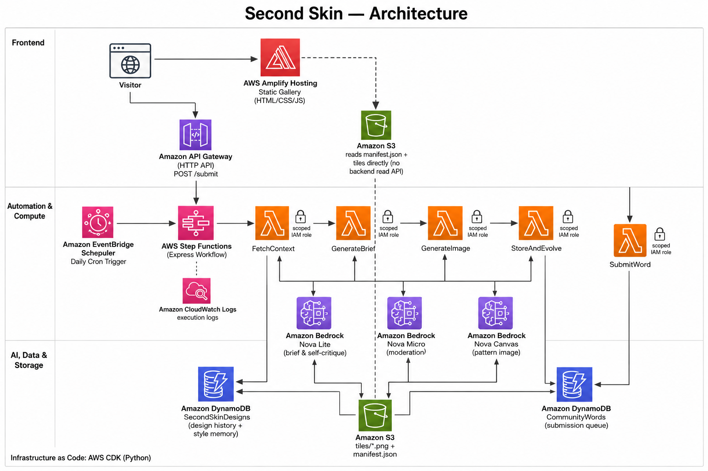

# Second Skin

**An always-on AWS agent that runs its own textile design studio — no prompting, no opening the app. It just makes something new every day and has it ready when you return.**

Built for the AWS Builder Center **Weekend Creative Agent Challenge**.

📄 **Read the full write-up:** [Weekend Creative Agent Challenge: Second Skin](https://builder.aws.com/content/3IDIVlvmdpuaYkrsxRRckMx345D/weekend-creative-agent-challenge-second-skin)

---

## The problem

Most "creative AI" tools put all the effort on you: open the app, write a prompt, wait, repeat. The output is a one-shot snapshot — it doesn't remember what it made yesterday, doesn't respond to the world around it, and doesn't get better or more distinctive over time. The tool you have to keep opening is a tool you eventually stop opening.

## The solution

Second Skin is a textile design studio that runs itself. Once a day, entirely unattended, it:

1. **Reads the world** — the date, day of week, real weather for its home city, and the oldest mood word a visitor has submitted.
2. **Remembers itself** — reads a rolling memory of the private style notes it wrote to itself on previous days, so its aesthetic visibly *drifts* over time instead of resetting every run.
3. **Designs a brief** (Amazon Bedrock Nova Lite) — a palette, a motif, a mood — shaped by all of the above.
4. **Weaves a pattern** (Amazon Bedrock Nova Canvas) — a seamless tile, image-conditioned on *yesterday's* tile, so today's design is visibly derived from it rather than random.
5. **Reflects privately** — critiques its own output into a one-line note that becomes tomorrow's memory.
6. **Publishes** the tile, the designer's note, and an open "nudge tomorrow's design" box to a public gallery — ready before you ever open the site.

It covers all four of the challenge's suggested angles — daily output, weather/day theming, community remixing, and improving style over time — as one coherent product instead of picking just one.

## Architecture



The pipeline is orchestrated by **AWS Step Functions**, not a single monolithic function — five small, single-purpose Lambdas, each with narrowly-scoped IAM (no wildcard resource ARNs anywhere), and a **Retry + Catch fallback on every Bedrock call**. If context-fetching fails, it falls back to sane defaults. If brief generation fails, it falls back to a templated brief. If image generation fails, it publishes with a placeholder tile instead of losing the day. Only a genuine persistence failure is allowed to fail the run outright.

That design wasn't theoretical — it was proven live, under a real (not staged) failure: this account's brand-new Bedrock quota came in at zero, and the pipeline kept completing and publishing anyway, exactly as designed.

### AWS services used

| Layer | Service | Role |
|---|---|---|
| Trigger | **Amazon EventBridge Scheduler** | Fires the pipeline once a day, fully unattended |
| Orchestration | **AWS Step Functions** (Express) | Sequences the pipeline with per-step Retry/Catch resilience |
| Compute | **AWS Lambda** (×5) | `FetchContext`, `GenerateBrief`, `GenerateImage`, `StoreAndEvolve`, `SubmitWord` — single-purpose, narrowly-scoped IAM |
| Generative AI | **Amazon Bedrock** — Nova Lite (brief + self-critique), Nova Micro (moderation), Nova Canvas (pattern image) | All the studio's creative decisions |
| Database | **Amazon DynamoDB** (×2 tables) | `SecondSkinDesigns` (design history + style memory), `CommunityWords` (submission queue) |
| Storage | **Amazon S3** | Pattern tiles + `manifest.json`, read directly by the front end — no backend read API needed |
| API | **Amazon API Gateway** (HTTP API) | Public `POST /submit` endpoint for community mood words |
| Hosting | **AWS Amplify Hosting** | The public static gallery |
| Observability | **Amazon CloudWatch Logs** | Full execution visibility on the Express workflow |
| IaC | **AWS CDK** (Python) | The entire stack, reproducible and version-controlled — nothing clicked together by hand |

## Repo layout

```
infra/       AWS CDK (Python) — all infrastructure
lambdas/     the five Lambda functions + shared common/ code
frontend/    static gallery site (no build step), deployed via Amplify Hosting
scripts/     manual pipeline trigger + history backfill helper
assets/      seed assets (placeholder tile) shipped into S3 at deploy time
docs/        RUNBOOK.md, architecture image, article draft
```

## Quick start

```bash
cd infra
python3 -m venv .venv && source .venv/bin/activate
pip install -r requirements.txt
npm install --no-save aws-cdk   # or: npm install -g aws-cdk, if you have global npm perms

# confirm Bedrock model access for amazon.nova-lite-v1:0, amazon.nova-micro-v1:0,
# amazon.nova-canvas-v1:0 in your target region (Bedrock console -> Model access) first

npx cdk bootstrap   # first time only, per account/region
npx cdk deploy
```

Then wire the front end (`frontend/js/config.js`) to the two CfnOutputs (`ManifestUrl`, `SubmitApiUrl`) and connect Amplify Hosting to the repo, subfolder `frontend/`. Full step-by-step in [`docs/RUNBOOK.md`](docs/RUNBOOK.md), including how to manually trigger a run, backfill history, and verify the fallback behavior end to end.

## What I learned

A brand-new AWS account's Bedrock on-demand quota can start at literally zero, even with model access explicitly granted — worth checking days before a deadline, not the morning of. And designing for graceful degradation from day one, rather than bolting it on later, is what let this project survive a real, unplanned infrastructure failure and still ship something live and functional instead of a blank page. Full story in the [article](https://builder.aws.com/content/3IDIVlvmdpuaYkrsxRRckMx345D/weekend-creative-agent-challenge-second-skin).
